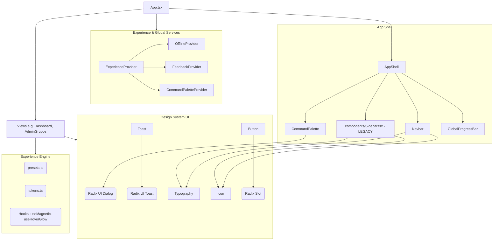

# Dependency Graph

## Análise de Acoplamento
- O `AppShell` ainda depende da `Sidebar.tsx` **legada** (acoplamento incorreto).
- O `App.tsx` possui acoplamento forte com formulários de autenticação.
- Nenhuma dependência circular detectada.
